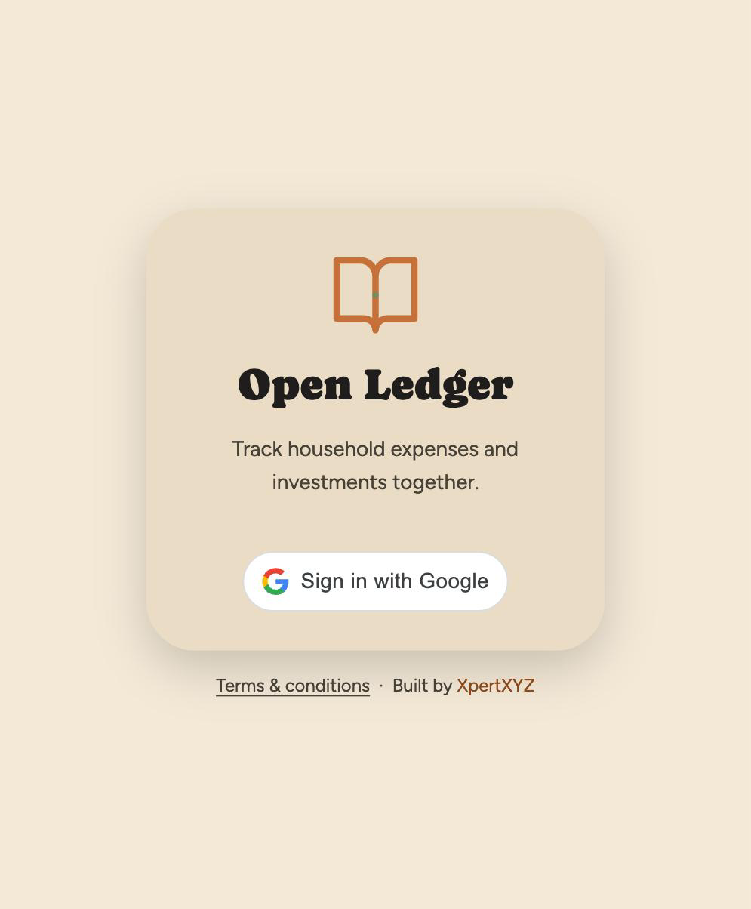
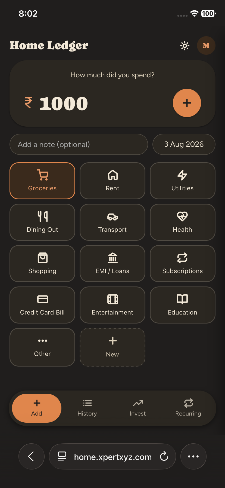
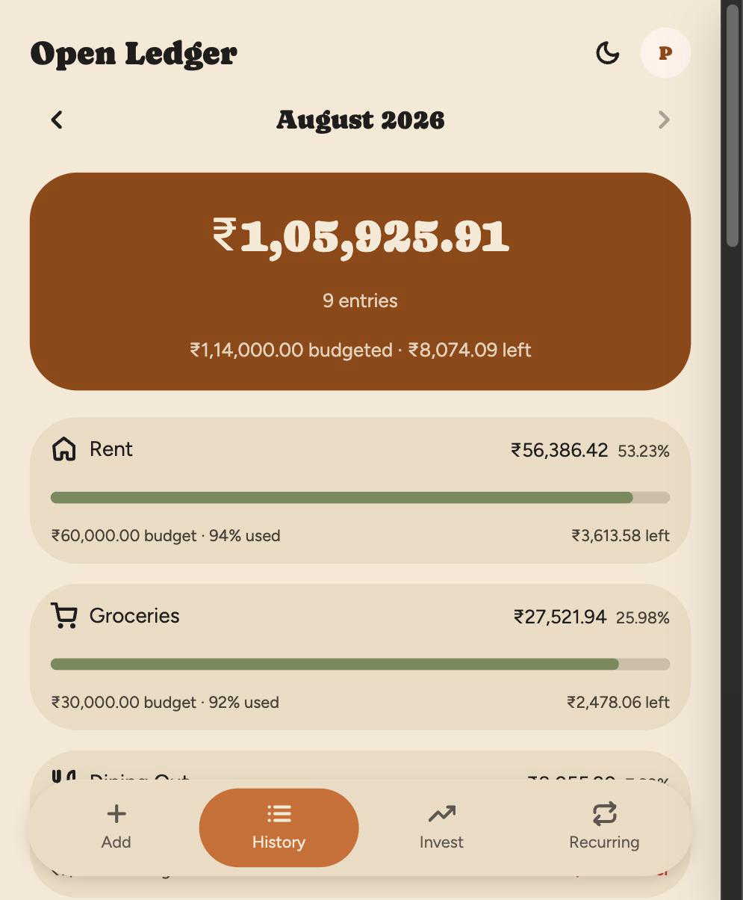
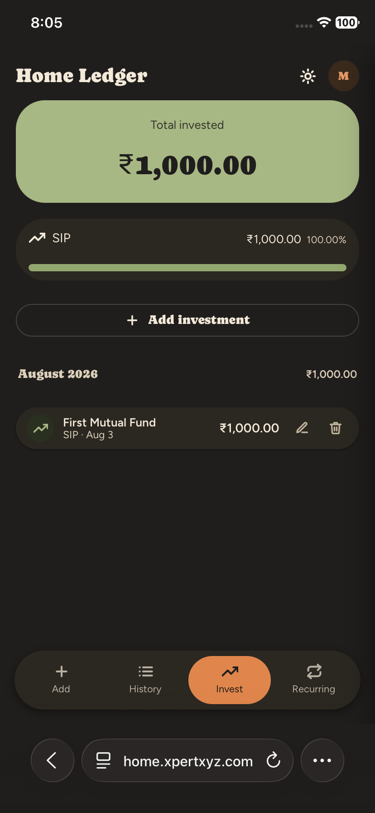
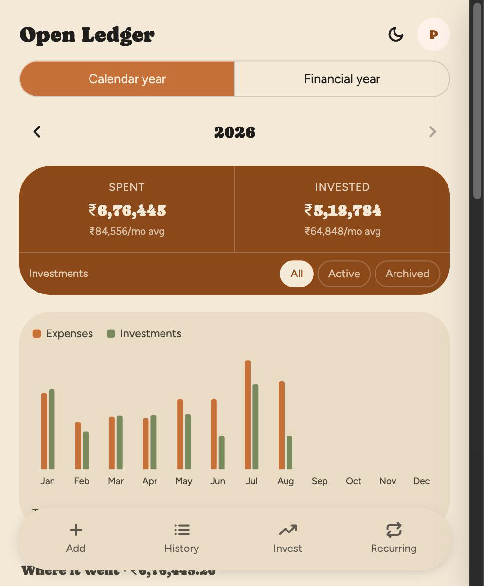
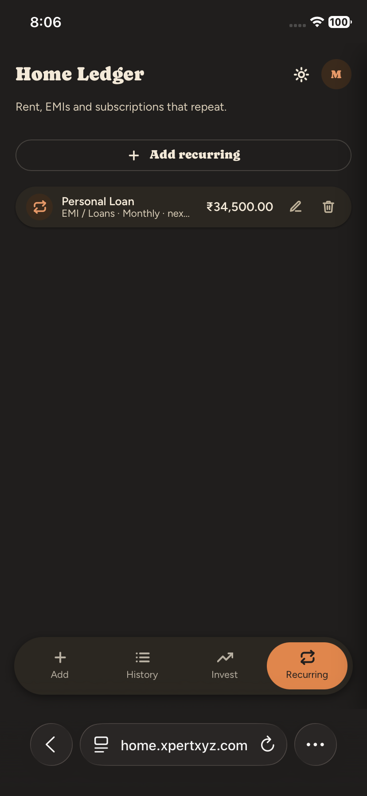
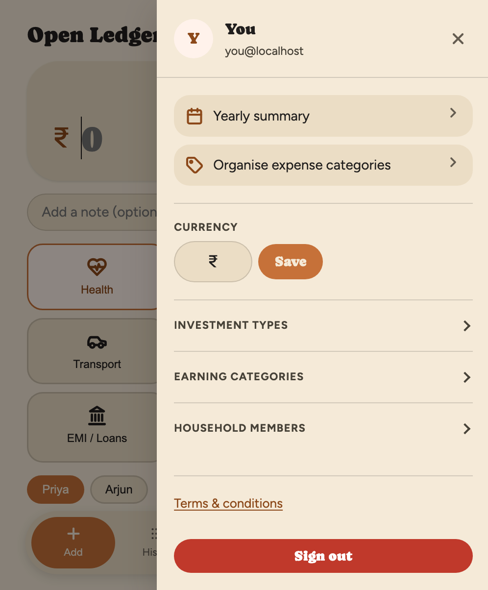

<p align="center">
  
</p>

<h1 align="center">Open Ledger</h1>

<p align="center">
  A warm, mobile-first household ledger — earnings, expenses, investments, recurring bills — for one shared household.<br>
  PHP + MySQL + Google One Tap sign-in. No build step. Deploys to any shared host.
</p>

<p align="center">
  <a href="https://ledger.xpertxyz.com"><strong>🌐 Try it live at ledger.xpertxyz.com</strong></a>
</p>

<p align="center">
  <a href="#quick-start">Quick start</a> ·
  <a href="#self-hosting">Self-hosting</a> ·
  <a href="#local-development">Local development</a> ·
  <a href="#features">Features</a> ·
  <a href="#architecture">Architecture</a> ·
  <a href="docs/DESIGN.md">Design spec</a>
</p>

> **Live instance disclaimer.** [ledger.xpertxyz.com](https://ledger.xpertxyz.com) is a real, running deployment you're welcome to use. **Data is not encrypted at rest** — see [`/terms`](https://ledger.xpertxyz.com/terms) inside the app. If that isn't OK for you, self-host in ten minutes with the [Quick start](#quick-start) below.

---

## Features

- **Add expense in three taps** — amount, category, done.
- **History** grouped by day with per-day totals + monthly category breakdown. Swipe left/right to change month.
- **Per-category monthly budgets** — set a limit per category and History shows spent / % used / left, turning red when you go over. Budgets **never block a spend**; they report, they don't police.
- **Sub-categories, one level deep** — nest "Rent" and "Maintenance" under "Household". Their spending rolls up into the parent's bar and counts against the parent's budget, with each child listed beneath it (plus a *Direct* line for the parent's own spend, so the lines always sum to the bar). Sub-categories carry no budget of their own.
- **Organise expense categories** screen — the one place expense categories are managed: rename, budget, nest, delete, and add. Renders as a tree, with each parent's children on a connector spine. It also merges one category's entries into another (recurring items follow, so nothing keeps posting into the category you just emptied).
- **Uncategorised is not a dead end** — expenses with no category, or whose category was deleted, are counted on that screen and can either be filed into a real category or deleted outright, behind a confirmation naming the exact count.
- **Earnings** grouped by month with a per-category breakdown (Salary, Interest, Other by default — add, rename and delete your own). The Earn tab summarises **this month / year to date / all time** and carries a rolling twelve-month **earned vs spent vs invested** chart.
- **Investments** grouped by month with per-type breakdown (SIP, Stocks, FD-RD, Gold, PPF-EPF, and any custom types you add).
- **Archive an investment type** when a scheme ends — its entries stay logged but drop out of the active view. The Invest tab summarises **Active / Archived / Total**, and the list filters between them.
- **Yearly summary** — calendar year *or* Indian financial year (Apr–Mar), with a twelve-month earnings-vs-expenses-vs-investments chart, **Earned / Spent / Invested** totals, a *saved* line (earned − spent), income-source and category and type breakdowns, and per-month averages that divide by *elapsed* months so a year in progress isn't understated. Tap any month to open it in History.
- **Recurring items** that auto-post on their due date — expenses (rent, EMIs, subscriptions), earnings (salary, interest payouts) and investments (SIPs, RDs, auto-debits). Missed periods catch up in one sweep. Cascade delete of past auto-entries is optional per item.
- **Household sharing** — multiple members share one ledger. Attribute each expense to a member.
- **Editable everything** — every list row opens an inline edit modal. Rename categories and investment types anywhere and it reflects app-wide.
- **Google One Tap sign-in** — no passwords, no signup form, no account management surface.
- **Indian number formatting** — ₹10,00,000 (lakh/crore grouping), not ₹1,000,000.
- **Installable** — web app manifest + full app-icon set, so "Add to Home Screen" gets a real icon and standalone chrome on iOS and Android.
- **Warm light + dark themes**, per-user, persisted.
- **Any currency symbol** — free text, per user.
- **CSRF-guarded**, rate-limited (10 sign-ins / 15 min, 60 POSTs / min per IP), data-caps enforced server-side.
- **Pagination** on history, earnings + investments, with SQL-side aggregates so month/all-time totals stay cheap.
- **No build step, no npm, no composer** — just PHP + MySQL + a stylesheet.

## Screens

<table>
  <tr>
    <td align="center"><br><sub><b>Sign in with Google</b></sub></td>
    <td align="center"><br><sub><b>Add an expense</b></sub></td>
    <td align="center"><br><sub><b>History — budget per category</b></sub></td>
  </tr>
  <tr>
    <td align="center"><br><sub><b>Investments — active / archived</b></sub></td>
    <td align="center"><br><sub><b>Yearly summary — calendar or FY</b></sub></td>
    <td align="center"><br><sub><b>Recurring (expense &amp; investment)</b></sub></td>
  </tr>
  <tr>
    <td align="center" colspan="3"><br><sub><b>Profile drawer — currency, types, members</b></sub></td>
  </tr>
</table>

---

## Quick start

The fastest path if you already have PHP 8.1+ and a MySQL/MariaDB running locally.

```bash
git clone https://github.com/xpertxyz/HomeLedger
cd HomeLedger

# 1) Create the database (empty; schema self-installs on first request)
mysql -u root -e "CREATE DATABASE homeledger CHARACTER SET utf8mb4;
                  CREATE USER 'homeledger'@'localhost' IDENTIFIED BY 'homeledger';
                  GRANT ALL PRIVILEGES ON homeledger.* TO 'homeledger'@'localhost';"

# 2) Point config at it
cp .env.example .env
# then edit .env — for local, set:
#   DB_HOST=127.0.0.1
#   DB_NAME=homeledger
#   DB_USER=homeledger
#   DB_PASS=homeledger
#   APP_DEBUG=1                 # enables dev-stub sign-in (skip Google OAuth locally)
#   GOOGLE_CLIENT_ID=YOUR_CLIENT_ID.apps.googleusercontent.com   # any placeholder is fine for dev

# 3) Serve
php -S 127.0.0.1:8152 router.php
```

Open <http://127.0.0.1:8152/> and click **Continue as dev user**.

> The dev-stub sign-in only activates when *both* `APP_DEBUG=1` **and** the Google client id is still the placeholder. Setting a real client id disables the stub — the way it should be in production.

---

## Self-hosting

Open Ledger is designed for typical PHP shared hosts (Hostinger, cPanel, Bluehost, DreamHost, etc). You need:

- PHP **8.1+** with PDO/MySQL enabled (default on all modern hosts)
- **MySQL 5.7+** or **MariaDB 10.3+**
- Apache with `mod_rewrite` (or LiteSpeed) — `.htaccess` is committed
- The ability to add a **cron job** (once daily is enough)
- A domain, and access to **Google Cloud Console** to create an OAuth client

### 1. Create a Google OAuth client

1. Visit <https://console.cloud.google.com/apis/credentials>.
2. Create Project → **Credentials** → **Create Credentials → OAuth 2.0 Client ID**.
3. Application type: **Web application**.
4. **Authorised JavaScript origins** — add your deploy URL (e.g. `https://ledger.example.com`) plus `http://localhost:8152` for local dev if you'll test that way.
5. No client secret is used (Google Identity Services doesn't need it for ID token flow). Copy the **Client ID** (looks like `1234567890-abcdef.apps.googleusercontent.com`).

> **Changing domains later?** The origin list is exact-match — no wildcards, and a subdomain change counts as a different origin. If you move the app, add the new origin *before* cutting over, or sign-in breaks for everyone with a silent `origin_mismatch` in the browser console. Keep the old origin listed until DNS has fully propagated.

### 2. Provision the MySQL database

In your host's control panel (Hostinger: hPanel → Databases → MySQL Databases), create:
- An empty database (e.g. `u123_ledger`)
- A user with all privileges on that database
- Note the host (usually `localhost` on shared hosting)

**No schema import needed.** The app creates its tables on the first request via `CREATE TABLE IF NOT EXISTS`.

### 3. Deploy the code

**Option A — Git deploy (recommended)**
Most hosts support automatic git deploys. Point their integration at your fork of this repo. Every push pulls into `public_html/`.

**Option B — SFTP**
Run `php index.php --preflight` locally first; it fails on anything that would break the deploy. Then upload everything to `public_html/` except:
- `.env` (create on server — see step 4)
- `data/` (created automatically — but see the writability note below)
- `docs/` (optional — only if you want the design spec on the server)
- `router.php` (only needed for `php -S` local dev)

Don't forget `manifest.webmanifest` and `assets/app-icon/` — without them the install icons 404.

> **Make sure `data/` is writable by PHP** (`chmod 755 data`). See the note under [Local development](#local-development) for why this one matters more than it looks.

### 4. Create `.env` on the server

In your `public_html/` root:

```
DB_HOST=localhost
DB_NAME=your_db_name
DB_USER=your_db_user
DB_PASS=your_db_password

GOOGLE_CLIENT_ID=1234567890-abcdef.apps.googleusercontent.com

# Leave APP_DEBUG unset (or 0) in production.
```

`chmod 600 .env` for good measure. The `.htaccess` already denies web access to dotfiles.

### 5. Add a daily cron job

For recurring bills/SIPs to auto-post reliably, run:

```
0 3 * * * /usr/bin/php /home/USER/public_html/index.php --cron
```

(Substitute your actual PHP path and web root. On Hostinger: hPanel → Advanced → Cron Jobs.)

The cron job:
- Sweeps only households with **due** recurring items (indexed query, cheap even at scale)
- Cascades through missed periods safely (capped at 120 iterations per item)
- Garbage-collects the `rate_limits` table

The sweep also runs opportunistically on every authed request as a fallback — the cron is belt-and-braces.

### 6. Visit the site

Hit your domain. The schema installs on the first request. Sign in with Google. Done.

### HTTPS behind a proxy

Serve the site over HTTPS. Many shared hosts and CDNs terminate TLS at a proxy and forward plain HTTP to PHP, so `$_SERVER['HTTPS']` is unset even though the visitor is on `https://`. The app therefore also honours `X-Forwarded-Proto` (and port 443) when deciding whether to set the session cookie's `Secure` flag and which scheme to use in canonical/OG URLs.

If your host does something non-standard, check `isHttps()` in `lib.php`. Getting this wrong means session cookies are sent without `Secure` and link previews point at `http://`.

---

## Local development

```bash
# From the repo root
php -S 127.0.0.1:8152 router.php
```

- `router.php` is a 4-line front controller for PHP's built-in server (serves static files as-is, delegates everything else to `index.php`). Only used locally — on real hosts, `.htaccess` handles this.
- Set `APP_DEBUG=1` in `.env` to make PHP errors show on-page (never do this in production).
- Self-check the CLI logic: `php index.php --selfcheck`
- Dry-run the cron sweep: `php index.php --cron`

- Gate a deploy: `php index.php --preflight` (syntax, schema columns/indexes, assets, config, `data/` writability)

To reset the DB during dev, delete the schema sentinel and drop the database:
```bash
rm -f data/.schema-ok-*        # glob, so it survives sentinel version bumps
mysql -u root -e "DROP DATABASE homeledger; CREATE DATABASE homeledger CHARACTER SET utf8mb4;"
# Next page load runs the fresh schema
```

> **`data/` must be writable.** The schema bootstrap writes a sentinel file there once, then skips itself on every later request. If the directory isn't writable the sentinel never lands and **every request re-runs the full `CREATE TABLE` + `ALTER TABLE` set** — slow, and it floods the error log. `--preflight` fails loudly on this.

---

## Architecture

Small, single-language, single-file-ish. The whole app is five PHP files.

| File | Role |
|---|---|
| `index.php` | Front controller — routes, POST handlers, CLI modes (`--cron`, `--selfcheck`). |
| `lib.php` | Schema, migrations, DB bootstrap, session/CSRF helpers, rate limiter, Google ID-token verifier, recurring sweep. |
| `views.php` | All rendering — layout wrapper, per-page render functions, right-side profile drawer, shared confirm & edit modals. |
| `config.php` | `.env` loader + config array. User-editable. |
| `router.php` | Local-dev front controller for `php -S`. Not used on real hosts. |
| `.htaccess` | Rewrites everything through `index.php`, denies raw access to internals, sets security headers. |
| `design-tokens/styles.css` | The Organic design system — colours, type, spacing, radii, shadow tokens + component classes (`.btn`, `.card`, `.tag`, `.dialog`, `.input`). Linked directly, never rebuilt. |
| `manifest.webmanifest` | Web app manifest — name, standalone display, theme colours, install icons. |
| `assets/app-icon/` | App icon: SVG source + PNGs at 16/32/180/192/512. Favicon, apple-touch-icon, and Android install icons. |
| `assets/icons/`, `assets/logo/` | Reference SVG icons (Lucide) + wordmark and OG image. **Note:** the app renders icons from the inlined `SVG_SPRITE` constant in `views.php`, not from `assets/icons/` — edit the sprite to change what's on screen. |

### Data model

```
households ─┬─ users        (Google-authenticated, one per person)
            ├─ members      (attributable spender per entry)
            ├─ categories   (expense categorization; defaults + custom; `budget` = monthly cap, 0 = none;
            │                `parent_id` = sub-category, one level, always budget 0)
            ├─ investment_types    (SIP, Stocks, ...; editable; `archived` hides its entries)
            ├─ earning_categories  (Salary, Interest, Other; fully editable, min one)
            ├─ expenses     (fact table, indexed on (household_id, date))
            ├─ investments  (fact table, indexed on (household_id, date))
            ├─ earnings     (fact table, indexed on (household_id, date))
            └─ recurring    (kind: 'expense' | 'earning' | 'investment' — auto-posts to the right table)
rate_limits (bucket, hits, window_end)  — GC'd by cron
```

Expenses, earnings and investments each carry a nullable `recurring_id` FK so cascade delete of a recurring item can optionally sweep every auto-posted entry it created.

`recurring.category_id` is read against whichever category table the row's `kind` implies — `categories` for an expense, `earning_categories` for an earning — and is re-validated against that table on every save, so switching kind can never carry an id across.

Schema changes are additive and idempotent: append to the `MIGRATIONS` array in `lib.php` and bump the sentinel filename. Each statement runs independently, and a duplicate-column error is logged and skipped, so re-running is safe.

Six behaviours worth knowing:
- **"Uncategorised" has one definition.** `category_id IS NULL` *or* pointing at a row that no longer exists — both render identically, so `uncategorisedWhere()` in `lib.php` is the single predicate the History bucket, the on-screen count, the file-away move and the bulk delete all share. Two definitions would mean the number on the button disagrees with what it touches.
- **Every structural change confirms first, and the dialog names the consequence.** Deletes, bulk moves, and both directions of nesting go through the shared `askConfirm()` dialog, whose body states the actual outcome — how many entries move, whether they survive, what budget a sub-category gives up. Only same-tap edits (rename, budget, currency, theme) submit straight through. That dialog posts `_csrf` + `id` + `back` and nothing else, which is why lifting a sub-category out needs no extra route: a missing `parent_id` already reads as "top level". Actions carrying more state — the two-select move and nest forms — bring their own `<dialog>`.
- **Sub-categories are one level and budget-free.** `categories.parent_id` points at a top-level category in the same household; a row that has children can't be given a parent, and a row that has a parent can't be given children. Assigning a parent zeroes the child's budget — the household budget total sums top-level budgets only, so a child holding its own would double-count. Deleting a parent promotes its children to top level rather than stranding them.
- **Earning categories are referenced by id, not by name** (`earnings.category_id`), so renaming one needs no cascade and deleting one leaves its earnings logged but *Uncategorised*. The last remaining category can't be deleted — the add form picks from that list.
- **Archiving is per *type*, matched by name** (`investments.type` stores the name, and renames cascade). Archiving hides a type's entries from the active view and removes it from the *add* pickers, but keeps it in the *edit* pickers so existing entries stay editable.
- **A recurring item keeps posting into an archived type.** Nothing is silently stopped — the archive confirmation says so and points you at the Recurring tab.

### Security

- **Auth**: Google Identity Services (One Tap + fallback button). ID token verified server-side against Google's `tokeninfo` endpoint (audience, issuer, expiry, `email_verified` checked).
- **Sessions**: `HttpOnly` + `SameSite=Lax` + `Secure` (on HTTPS) cookies, `session_regenerate_id(true)` on login, `use_only_cookies` + `use_strict_mode`.
- **CSRF**: Session-scoped token on every POST form (`hash_equals` compared). Google's own `g_csrf_token` double-submit for the sign-in callback.
- **Rate limiting**: Atomic per-IP upsert (`INSERT ... ON DUPLICATE KEY UPDATE`) — 10 sign-ins / 15 min, 60 POSTs / min. Returns `429` with `Retry-After`.
- **Data caps**: Amounts, note lengths, per-household counts (200 expenses/day, 1000 investments, 2000 earnings, 100 recurring, 100 categories of each kind, 20 members) enforced at insert time. Bulk category moves are scoped to the signed-in household on both sides.
- **Household scoping on writes**: category and member ids arrive from `<select>` fields, so every one is re-checked against the signed-in household before it is stored (`ownedId()`); a forged id degrades to *uncategorised* instead of attaching to another household's row.
- **SQL**: PDO prepared statements with `EMULATE_PREPARES=false`.
- **XSS**: `htmlspecialchars` on every output; JSON payloads inside `onclick=""` attributes go through both `json_encode` and `h()`.
- **Redirects**: post-submit targets come from a `back` form field, so every redirect is validated same-site — root-relative paths only, no `//host`, no absolute URLs, no CR/LF header injection.

Full audit and disclosures live in `docs/DESIGN.md` and the `/terms` route in-app.

### What's intentionally missing

Open Ledger is **not** encrypted at rest. Anyone with database access can read your entries. Self-host if that isn't OK.

No analytics, no third-party trackers, no ad SDKs. The only outbound request the app makes is to Google's `tokeninfo` endpoint at sign-in time.

---

## Contributing

Fork, PR. Keep the ponytail — new features prefer the simplest thing that works. Do not add build steps, package managers, or dependencies unless the alternative is worse.

Coding style:
- No frameworks. Plain PHP with `<?php ?>` templates in `views.php`.
- One file per concern (rendering, routing, helpers).
- Add server-side validation for every user input at the trust boundary.
- Add an assertion to `php index.php --selfcheck` if a helper has non-trivial branching. Prefer extracting the branch into a pure function so it *can* be asserted — `investmentFilterSql()` and `safeRedirectTarget()` exist for exactly that reason.

---

## License

MIT. See `LICENSE` (add one if forking).

---

<p align="center">
  Built by <a href="https://xpertxyz.in"><strong>XpertXYZ</strong></a> — digital solutions across platforms.<br>
  <sub>Live at <a href="https://ledger.xpertxyz.com">ledger.xpertxyz.com</a> · Source at <a href="https://github.com/xpertxyz/HomeLedger">github.com/xpertxyz/HomeLedger</a></sub>
</p>
